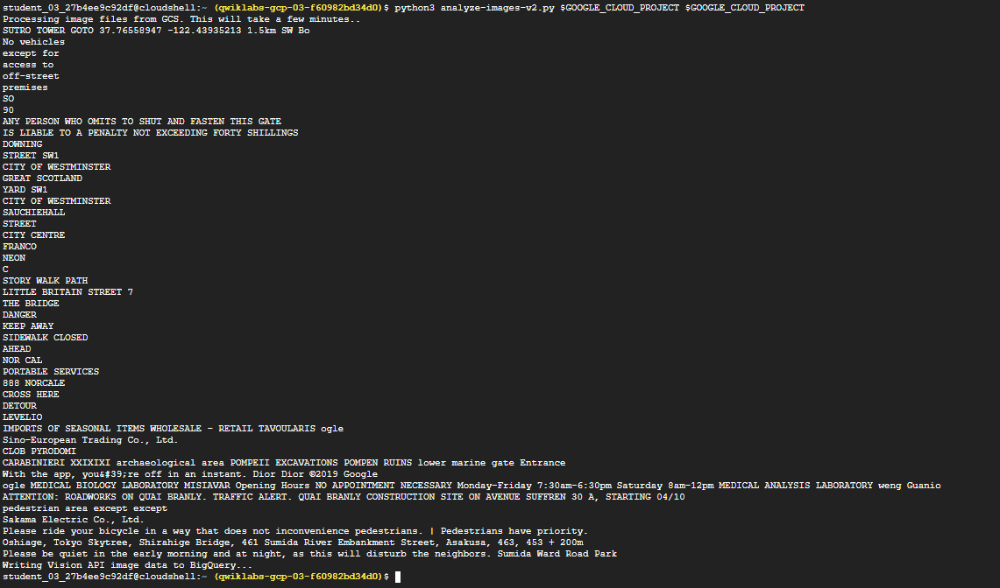
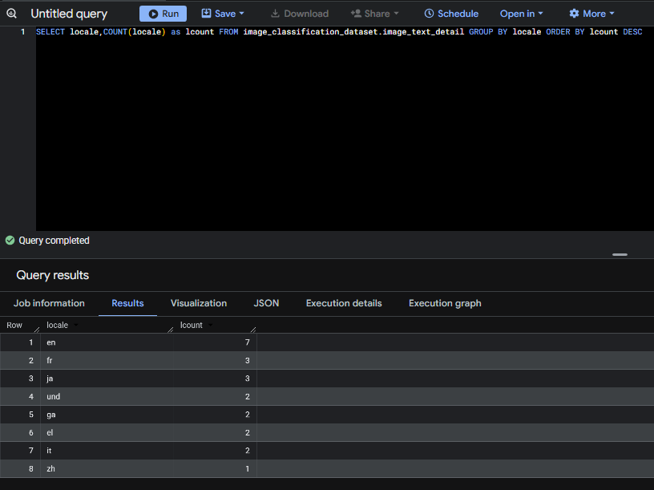

# GSP329 - Use Machine Learning APIs on Google Cloud: Challenge Lab

## Overview

This project demonstrates how to use Google Cloud Machine Learning APIs to extract and translate text from images. The extracted text is stored in BigQuery for analysis and classification as part of a machine learning pipeline.

---

## Architecture

```text
Cloud Storage (Images)
        ↓
Google Vision API (Text Extraction)
        ↓
Google Translation API (Text Translation)
        ↓
BigQuery (Data Storage & Analysis)
```

---

## Technologies Used

- Google Cloud Vision API
- Google Cloud Translation API
- Google BigQuery
- Google Cloud Storage
- Python
- Service Accounts & IAM

---

## Setup & Deployment

### Step 1 - Create Service Account
```bash
gcloud iam service-accounts create ml-api-service-account \
  --display-name "ML APIs Service Account"
```
> Expected output: Service account created successfully

### Step 2 - Bind IAM Roles
```bash
gcloud projects add-iam-policy-binding $GOOGLE_CLOUD_PROJECT \
  --member="serviceAccount:ml-api-service-account@$GOOGLE_CLOUD_PROJECT.iam.gserviceaccount.com" \
  --role="roles/bigquery.admin"

gcloud projects add-iam-policy-binding $GOOGLE_CLOUD_PROJECT \
  --member="serviceAccount:ml-api-service-account@$GOOGLE_CLOUD_PROJECT.iam.gserviceaccount.com" \
  --role="roles/storage.objectAdmin"

gcloud projects add-iam-policy-binding $GOOGLE_CLOUD_PROJECT \
  --member="serviceAccount:ml-api-service-account@$GOOGLE_CLOUD_PROJECT.iam.gserviceaccount.com" \
  --role="roles/serviceusage.serviceUsageConsumer"
```
> Expected output: IAM policy updated successfully for all roles

### Step 3 - Download Credentials
```bash
gcloud iam service-accounts keys create key.json \
  --iam-account=ml-api-service-account@$GOOGLE_CLOUD_PROJECT.iam.gserviceaccount.com

export GOOGLE_APPLICATION_CREDENTIALS=key.json
```
> Expected output: JSON credentials file created and environment variable set

### Step 4 - Copy Python Script
```bash
gsutil cp gs://$GOOGLE_CLOUD_PROJECT/analyze-images-v2.py .
```
> Expected output: Script copied successfully from Cloud Storage

### Step 5 - Vision API Integration
Find the `# TBD` sections in the script and fill in:
```python
image = vision.Image(content=file_content)
response = vision_client.document_text_detection(image=image)
translation = translate_client.translate(desc, target_language='<Locale>')
```
> Expected output: Text extracted from each image and saved as .txt files in Cloud Storage

### Step 6 - Translation API Integration
Find the `TBD for translation` block and fill in:
```python
    translation = translate_client.translate(desc, target_language='<Locale>')
    if locale != '<Locale>':
        translated_text = translation['translatedText']
    else:
        translated_text = desc
```
Then remove the `#` from the BigQuery upload line:
```python
errors = bq_client.insert_rows_json(table_ref, rows_for_bq)
```
> Expected output: Text translated to English and uploaded to BigQuery table

### Step 7 - Run the Script
```bash
python3 analyze-images-v2.py $GOOGLE_CLOUD_PROJECT $GOOGLE_CLOUD_PROJECT
```
> Expected output: All images processed, text extracted, translated and uploaded to BigQuery



---

## Verification

Run this BigQuery query to confirm data was loaded successfully:
```sql
SELECT locale, COUNT(locale) as lcount 
FROM image_classification_dataset.image_text_detail 
GROUP BY locale 
ORDER BY lcount DESC
```
> Expected output: Table showing count of each language found in the images


---

## BigQuery Table

| Field | Description |
|-------|-------------|
| locale | Language code of the detected text |
| lcount | Number of images with that language |



---

## Lab Reference

- Lab: GSP329 - Use Machine Learning APIs on Google Cloud: Challenge Lab
- Platform: Google Cloud Skills Boost (Qwiklabs)
- Course: Use Machine Learning APIs on Google Cloud

## AUTHOR

Prateek Kumar [Github](https://github.com/KumarPrateek16)